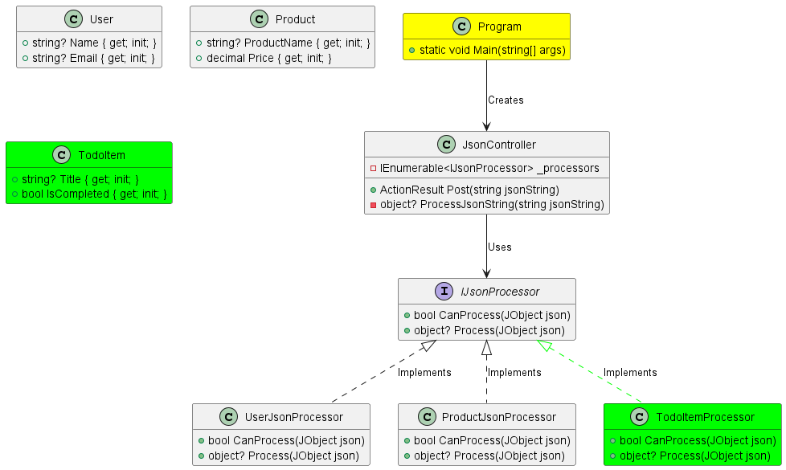

##  Implementing a Todo Item Processor

In this exercise, the aim is to enhance a processing system by introducing a functionality to manage Todo items. By adding a `TodoItem` record and a `TodoItemProcessor` class, you will enable the program to mark Todo items as completed as part of the processing. This task encourages the application of SOLID design principles, notably the Open/Closed Principle, alongside the Strategy Design Pattern.

### Understanding the UML Diagram:

Below is the UML diagram representing the structure of the codebase for this assignment. In this diagram:
- **Green**: Indicates the new classes and records you need to add.
- **Yellow**: Indicates the class that requires updating with new dependency registrations.



### Instructions:

1. **Create a `TodoItem` Record:**
- Navigate to the `Models` folder and create a new file named `TodoItem.cs`.
- Define a `public` record named `TodoItem` with the following read-only properties (using the `init` accessor):
- `string Title`
- `bool IsCompleted`

2. **Create a `TodoItemProcessor` Class:**
- Navigate to the `JsonProcessors` folder and create a new file named `TodoItemProcessor.cs`.
- Define a `public` class named `TodoItemProcessor` that implements the `IJsonProcessor` interface.
- Implement the `CanProcess` method to check if the provided `JObject` contains the necessary keys for a `TodoItem`.
- Implement the `Process` method to deserialize the `JObject` to a `TodoItem` object. Utilize the `with` operator to create a safe, non-destructive copy of the `TodoItem` with the `IsCompleted` property set to `true`.

3. **Update Dependency Injection:**
- Navigate to the `Program` class.
- In the `Main` method, locate the section where dependency injection is set up.
- Add a new line to register the `TodoItemProcessor` class with the dependency injection collection.

---

### Running the Application:

1. Run the application. The Swagger UI will pop up.
2. To test the `TodoItemProcessor`, use the following JSON string in the Swagger UI:
```
"{\"Title\":\"Buy Milk\",\"IsCompleted\":false}"
```
This will simulate processing a Todo item and should return a Todo item with `IsCompleted` set to `true`.

---

### Notes:

- Your implementation should adhere to the Open/Closed Principle; no existing code should be modified except for the dependency injection setup in the `Program` class.
- This design follows the Strategy Design Pattern by enabling the program to use different processors interchangeably through the `IJsonProcessor` interface.
- Ensure your code is clean, and follows the coding standards discussed in class. The `TodoItem` record's properties should remain read-only, demonstrating the safe handling of data by utilizing the `with` operator in the `TodoItemProcessor` class.

